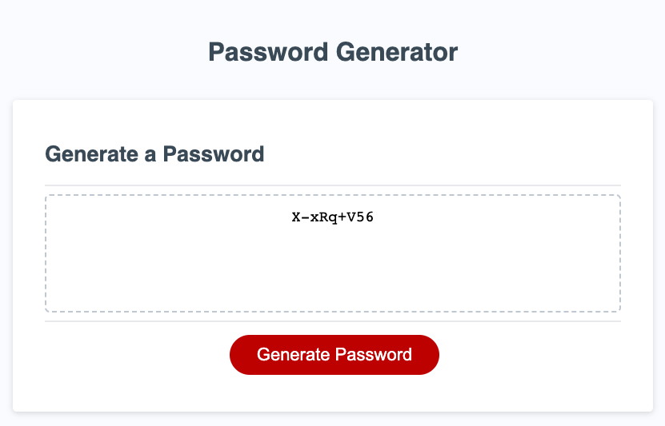
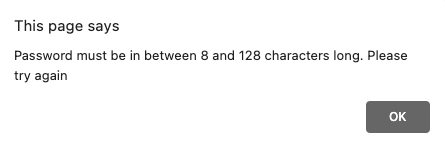
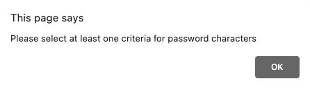

# Secure Password Generator

[Password Generator](https://overtonr.github.io/password-generator/)



## Description
Using Javascript functions, this application generates a unique password for users to create depending on the criteria of included characters they select. There are many ways to randomize a password by selecting the number of characters, and if the password contains lowercase characters, uppercase characters, numbers, and special characters. Play around with this application and find the random secure password just for you!

<br>

[](https://opensource.org/licenses/MIT)

<br>

## Table of Contents
- [Usage](#usage)
- [Technologies Used](#technologies-used)
- [License](#license)
- [Questions](#questions)

<br>


## Usage
Navigate to the [deployed link](https://overtonr.github.io/challenge-password-generator/) and follow the instructions. Make sure to enter a valid number of characters or the application will alert you with an error:



```js
passLength = prompt('How long is your desired password length? please enter a number between 8 and 128.')
  if (passLength < 8 || passLength > 128) {
    alert('Password must be in between 8 and 128 characters long. Please try again');
    return;
  };
```

Also make sure to select at least one of the criteria for required character to generate a password:




```js
if (!hasLower && !hasUpper && !hasNum && !hasSpecial){
    alert("Please select at least one criteria for password characters");
    return;
  }
```

Click the button when finished to generate another random password.

<br>

## Technologies Used:
* Github
* HTML
* CSS
* JavaScript
* VS Code

<br>

## License
This application is covered under the MIT License

<br>

## Questions
https://github.com/overtonr
